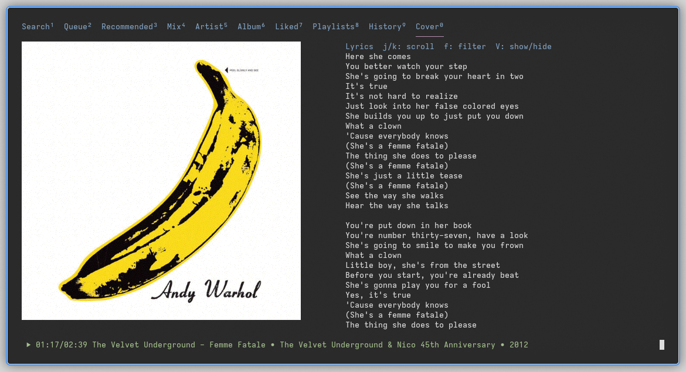
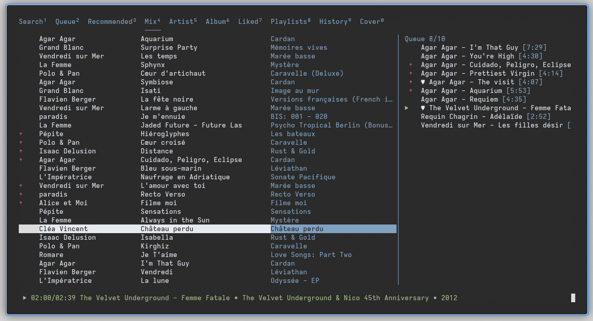
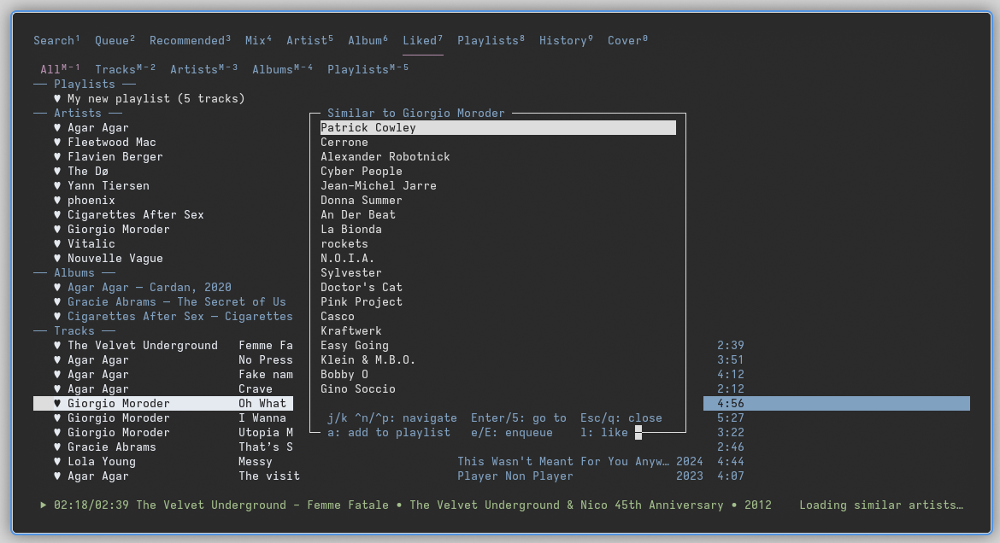
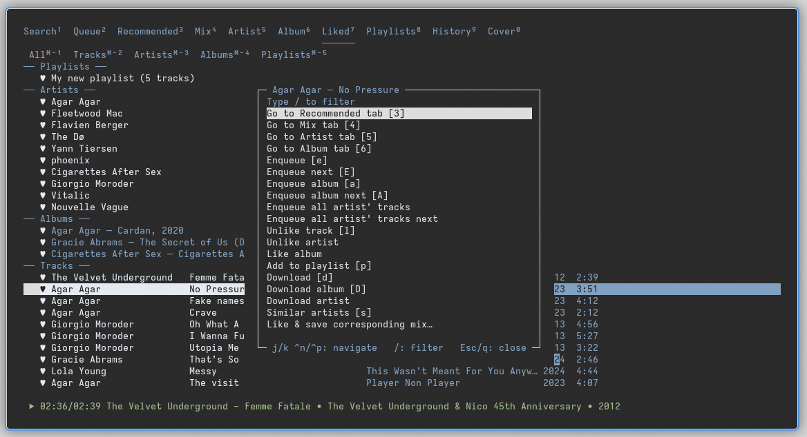

# tuifi

1.  [Features](#features)
2.  [Usage](#usage)
3.  [Requirements](#requirements)
4.  [Installation](#installation)
    1.  [Windows peculiarities](#windows-peculiarities)
5.  [Configuration](#configuration)
6.  [Development note](#development-note)
7.  [Disclaimer](#disclaimer)
    1.  [Content extraction](#content-extraction)
    2.  [DMCA and copyright infringements](#dmca-and-copyright-infringements)
8.  [License](#license)
9.  [Mirrors](#mirrors)

A feature-rich-ish TUI music player built on top of [TIDAL HiFi API](https://github.com/binimum/hifi-api): browse, search, stream, download, organize and manage lossless music from your comfy terminal.

While [HiFi API instances with unrestricted access](https://github.com/monochrome-music/monochrome/blob/main/INSTANCES.md) exist, this may be considered as music piracy in many countries and does not give artists the love they deserve. This project is intended for TIDAL subscribers who also self host their own HiFi instance for convenience, and favor a keyboard-driven terminal workflow over a web player.

*Click any screenshot to play the demo video. Another video from an older version is available [here](demo/tuifi-demo_old.mp4), showing some other features.*

# Features

## Playback & queue

- Playback control (play, pause, (auto)resume, seek, volume, repeat, shuffle)
- Autoplay mix or recommendations (infinite queue)
- Queue management with reordering and priority flags
- Playback history
- Lyrics display
- Cover art (requires a compatible terminal emulator)

## Library management & discovery

- Search, browse artists/albums, recommendations, mixes
- Find similar artists
- Playlists (create, delete, add/remove tracks)
- Like tracks, albums, artists, and playlists
- Accountless: playlists, liked songs and queue are kept in standard json files that some popular TIDAL HiFi web players can import
  
## Downloads

- Download individual or multiple tracks (_e.g._, marked, albums, playlists), or full artist discographies for offline playback in other music players; depending on the laws in your country, owning a physical copy of the media you download may be required even with a valid TIDAL subscription

## Interface & interaction

- Contextual menus on tracks, albums & artists
- Keyboard-oriented control
- Customizable (colors, optional TSV mode, show/hide metadata fields, file hierarchy for downloads, autoplay buffer, autoresume playback on launch, _etc._)

# Usage

    Usage: ./tuifi [options]

    Options:
      --api URL, -a URL   TIDAL HiFi API base URL (can also be set in settings.json)
      --verbose, -v       Write debug log to debug.log in the config directory
      --version, -V       Show version

    Press ? in tuifi for keybindings

# Requirements

- Python 3.7+ (3.13 on Windows)
- [mpv](https://mpv.io)
- (Optional for cover art rendering) [chafa](https://github.com/hpjansson/chafa/) and/or [ueberzugpp](https://github.com/jstkdng/ueberzugpp) and a terminal emulator [compatible](https://www.arewesixelyet.com/) with Sixel or Kitty graphics

# Installation

`tuifi` comes with a wrapper script (named `tuifi` too) at the root of the project, which will handle calling the different Python files. Threfore, it requires no system installation and this repository can just be cloned before executing the wrapper script:

    git clone https://git.sr.ht/~matf/tuifi cd tuifi
    ./tuifi

    # Or add it to your $PATH so that tuifi becomes a system wide command, e.g. with:
    mkdir -p ~/.local/bin
    ln -s /path/to/tuifi/tuifi ~/.local/bin/tuifi

## Windows peculiarities

The `ncurses` library does not exist officially for Windows, but `windows-curses` can be used. It is available via `pip` up to Python 3.13. The easiest way to install a specific Python version on Windows as well as the other dependency, `mpv`, is probably using [Chocolatey](https://chocolatey.org/install):

    choco install python313 mpv git -y # In an admin PowerShell
    python3.13.exe -m pip install windows-curses

Then make a shortcut that uses Python 3.13 specifically, or the following command:

    python3.13.exe /path/to/tuifi

# Configuration

While `tuifi` should be compatible with any HiFi API instance, some popular ones are made public and may therefore violate TIDAL's TOS. Consequently, the program is delivered with no default instance set, and users should set their preferred instance either using the `--api` runtime flag or by editing `settings.json`. Users choosing to use a public HiFi instance with no legitimate TIDAL subscription do so at their own risk.

Settings are stored in `settings.json` and automatically updated upon using toggles within the TUI. On first run, `tuifi` will prompt before creating the config directory.

Configuration file directory per platform:

<table border="2" cellspacing="0" cellpadding="6" rules="groups" frame="hsides">
<colgroup>
<col class="org-left" />
<col class="org-left" />
</colgroup>
<thead>
<tr>
<th scope="col" class="org-left">Platform</th>
<th scope="col" class="org-left">Path</th>
</tr>
</thead>
<tbody>
<tr>
<td class="org-left">Linux</td>
<td class="org-left"><code>~/.config/tuifi</code> (or <code>$XDG_CONFIG_HOME/tuifi</code>)</td>
</tr>
<tr>
<td class="org-left">Termux</td>
<td class="org-left"><code>/data/data/com.termux/files/home/.config/tuifi</code></td>
</tr>
<tr>
<td class="org-left">macOS</td>
<td class="org-left"><code>~/Library/Application Support/tuifi</code></td>
</tr>
<tr>
<td class="org-left">Windows</td>
<td class="org-left"><code>%APPDATA%\tuifi</code></td>
</tr>
</tbody>
</table>

`settings.json` can be edited to change UI options, colours, metadata field widths, autoplay buffer size, download destinations and naming conventions, TIDAL HiFi API URL, _etc._

Other state files stored in the same directory:

- `queue.json` keeps your current play queue among program executions,
- `liked.json` stores liked tracks,
- `playlists.json` stores playlists,
- `history.json` keeps the playback history.

`liked.json` and `playlists.json` are fully compatible with Monochrome (e.g., <https://monochrome.tf>) and can be imported there.

# Development note

This program was developed with significant AI assistance. I take no particular pride in that, or the resulting code, but it is fair to be honest about it. It was a week-end project and I wanted something usable quickly rather than something to be proud of architecturally.

# Disclaimer

## Content extraction

Any content accessed by this project is hosted by external non-affiliated sources, and everything served through `tuifi` is publicly accessible via the TIDAL Hi-Fi API. A web browser makes hundreds of requests to get everything made available by a site, this project goes on to make more targeted requests associated with only getting the content relevant to its purpose. If this project accesses your content, or content provided by your service, the code is public and may help you taking the necessary measures to counter the means to access it in the first place.

## DMCA and copyright infringements

This project is to be used at the user's own risk, based on their government and laws. No audio files or direct links to audio files are stored in this repository, the script merely interfaces with sources and API that exist independently and are publicly available. This project has no control over the content it finds at any point in time, and no control over the content served by the source services, it just uses a documented API provided by other tools to fetch targeted information and content otherwise available with a web browser.

Hence, any copyright infringements or DMCA claims in this project's regards are to be forwarded to the associated content provider or API by the associated notifier of any such claims. This script does not infringe copyright, just like a web browser or a search engine, users are responsible with how they use the tool, and thus is not a valid reason to send a DMCA notice to Codeberg or the maintainers of this repository. If any source accessed using the script infringes on your rights as a copyright holder, they may be removed by contacting the web host service that published them online and is actually hosting them (not Codeberg, nor the maintainers of this repository).

# License

[GNU Affero General Public License v3.0](https://www.gnu.org/licenses/agpl-3.0.html)

# Mirrors

<https://git.sr.ht/~matf/tuifi>, <https://codeberg.org/kabouik/tuifi>, <https://github.com/kabouik/tuifi>
