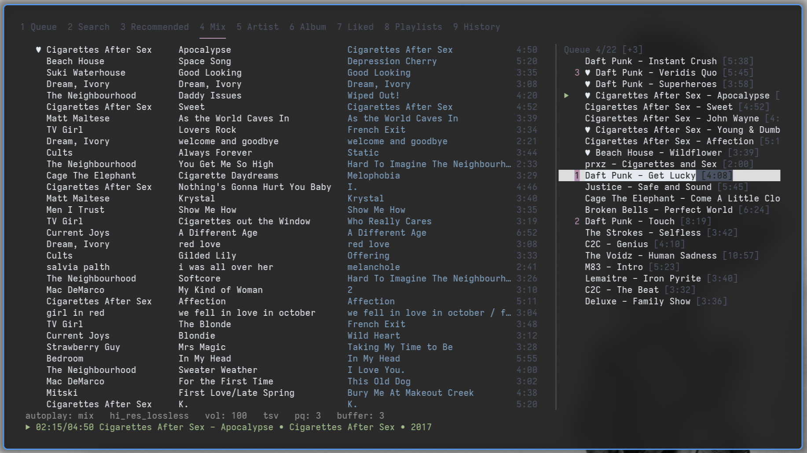

# tuifi

1.  [Features](#features)
2.  [Usage](#usage)
3.  [Requirements](#requirements)
4.  [Installation](#installation)
5.  [Configuration](#configuration)
6.  [Development note](#development-note)
7.  [Disclaimer](#disclaimer)
    1.  [Content extraction](#content-extraction)
    2.  [DMCA and copyright infringements](#dmca-and-copyright-infringements)
8.  [License](#license)
9.  [Mirrors](#mirrors)

A feature-rich-ish TUI music player built on top of [TIDAL HiFi API](https://github.com/binimum/hifi-api): browse, search, stream, download, organize and manage lossless music from your comfy terminal. While you may be able to access HiFi API instances right away, music piracy is illegal in most countries and is bad for the karma, and this project is intended for users who have a paid subscription but still favor a keyboard-driven terminal workflow.

_Click to play the demo video._

# Features

- Playback control (play, pause, resume, seek, volume, repeat, shuffle)
- Queue management with reordering and priority flags
- Search, browse artists/albums, recommendations, mix
- Autoplay mix or recommendations (infinite queue)
- Find similar artists
- Playlists (create, delete, add/remove tracks)
- Like tracks, albums, artists, and playlists
- Lyrics display
- Download individual or multiple tracks (e.g., marked, albums, playlists), or full artist discographies
- Playback history
- Customizable (colors, optional TSV mode, show/hide fields, file hierarchy for downloads, autoplay buffer)
- Keyboard-oriented control
- Accountless: playlists, liked songs and queue are kept in standard json files that some TIDAL HiFi web players can import

# Usage

    Usage: ./tuifi [options]

    Options:
      --api URL, -a URL   API base URL (default: https://api.monochrome.tf)
      --verbose, -v       Write debug log to debug.log in the config directory
      --version, -V       Show version

    Press ? in tuifi for keybindings

# Requirements

-   Python 3.7+ (3.13 on Windows)
-   [mpv](https://mpv.io)

# Installation

`tuifi` so far is a standalone script and requires no installation, you can just clone this repository and execute the script:

    git clone https://git.sr.ht/~matf/tuifi cd tuifi
    ./tuifi

    # Or add it to your $PATH so that tuifi becomes a system wide command, e.g. with:
    mkdir -p ~/.local/bin
    ln -s /path/to/tuifi/tuifi ~/.local/bin/tuifi

## Windows peculiarities

The `ncurses` library does not exist officially for Windows, but `windows-curses` can be used. It is available via `pip` up to Python 3.13. The easiest way to install a specific Python version on Windows as well as the other dependency, `mpv`, is probably using [Chocolatey](https://chocolatey.org/install):

    choco install python313 mpv git -y # In an admin PowerShell
    python3.13.exe -m pip install windows-curses

Then make a shortcut that uses Python 3.13 specifically, or the following command:

    python3.13.exe /path/to/tuifi

# Configuration

Settings are stored in `settings.json` and automatically updated upon using toggles within the TUI. On first run, `tuifi` will prompt before creating the config directory.

Config directory per platform:

<table border="2" cellspacing="0" cellpadding="6" rules="groups" frame="hsides">
<colgroup>
<col class="org-left" />
<col class="org-left" />
</colgroup>
<thead>
<tr>
<th scope="col" class="org-left">Platform</th>
<th scope="col" class="org-left">Path</th>
</tr>
</thead>
<tbody>
<tr>
<td class="org-left">Linux</td>
<td class="org-left"><code>~/.config/tuifi</code> (or <code>$XDG_CONFIG_HOME/tuifi</code>)</td>
</tr>
<tr>
<td class="org-left">Termux</td>
<td class="org-left"><code>/data/data/com.termux/files/home/.config/tuifi</code></td>
</tr>
<tr>
<td class="org-left">macOS</td>
<td class="org-left"><code>~/Library/Application Support/tuifi</code></td>
</tr>
<tr>
<td class="org-left">Windows</td>
<td class="org-left"><code>%APPDATA%\tuifi</code></td>
</tr>
</tbody>
</table>

`settings.json` can be edited to change UI options, colours, metadata field widths, autoplay buffer size, download destinations and naming conventions, TIDAL HiFi API URL, _etc._

Other state files stored in the same directory:

- `queue.json` keeps your current play queue among program executions,
- `liked.json` stores liked tracks,
- `playlists.json` stores playlists,
- `history.json` keeps the playback history.

`liked.json` and `playlists.json` are fully compatible with Monochrome instances (e.g., <https://monochrome.tf>) and can be imported there.

# Development note

This program was developed with significant AI assistance. I take no particular pride in that, or the resulting code, but it is fair to be honest about it. It was a week-end project and I wanted something usable quickly rather than something to be proud of architecturally.

# Disclaimer

## Content extraction

Any content accessed by this project is hosted by external non-affiliated sources, and everything served through `tuifi` is publicly accessible via the TIDAL Hi-Fi API. A web browser makes hundreds of requests to get everything made available by a site, this project goes on to make more targeted requests associated with only getting the content relevant to its purpose. If this project accesses your content, or content provided by your service, the code is public and may help you taking the necessary measures to counter the means to access it in the first place.

## DMCA and copyright infringements

This project is to be used at the user's own risk, based on their government and laws. No audio files or direct links to audio files are stored in this repository, the script merely interfaces with sources and API that exist independently and are publicly available. This project has no control over the content it finds at any point in time, and no control over the content served by the source services, it just uses a documented API provided by other tools to fetch targeted information and content otherwise available with a web browser.

Hence, any copyright infringements or DMCA claims in this project's regards are to be forwarded to the associated content provider or API by the associated notifier of any such claims. This script does not infringe copyright, just like a web browser or a search engine, users are responsible with how they use the tool, and thus is not a valid reason to send a DMCA notice to Codeberg or the maintainers of this repository. If any source accessed using the script infringes on your rights as a copyright holder, they may be removed by contacting the web host service that published them online and is actually hosting them (not Codeberg, nor the maintainers of this repository).

# License

[GNU Affero General Public License v3.0](https://www.gnu.org/licenses/agpl-3.0.html)

# Mirrors

<https://git.sr.ht/~matf/tuifi>, <https://codeberg.org/kabouik/tuifi>, <https://github.com/kabouik/tuifi>
